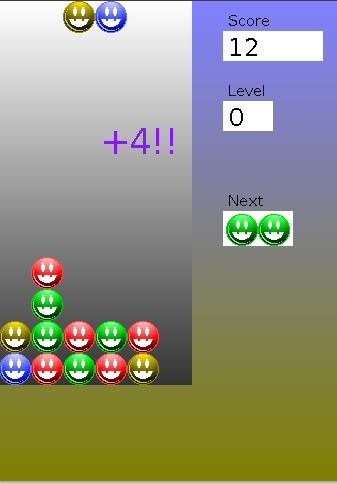

PUYO-PUYO-like game
===================
2005 - Mario Macias Lloret

Compiling and Running Game
--------------------------
Two easy ways:

1 - Import project from netbeans and run it

2 - From console, go to the folder where this file is and type: ant run

Game Rules
----------
Join groups of faces of the same color. When 4 faces of the same color are in
contact, they disappear. If faces reach the top of the window, game is finished.
The more faces you join, the higher scoring. Do combos to multiply scoring.

Game Controls
-------------
- CURSOR LEFT: move piece left
- CURSOR RIGHT: move piece right
- CURSOR UP: rotate piece
- CURSOR DOWN: drop piece

Some comments
-------------
Because the presentation of my studies final project, I were too busy for made
the game 100% accurate. There are some possible future improvements:

- Smooth movements for the pieces
- Better difficulty increase
- Better controls
- Better graphics
- Sound

Si te gustan mis aportaciones a github, quizás te gustará mi libro [Del bit a la Nube](http://www.xaas.guru/del-bit-a-la-nube/)
